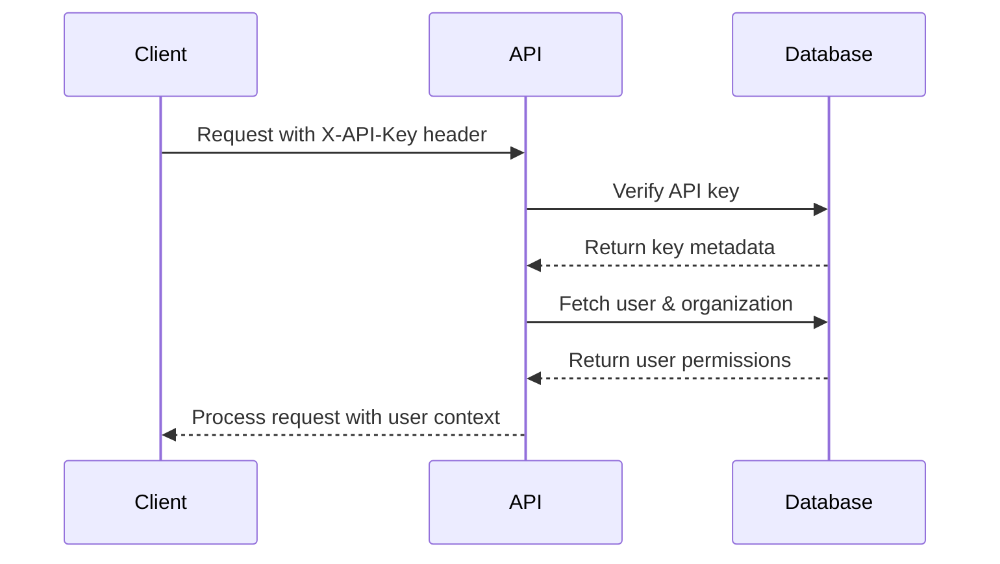

## Overview

Dokploy API supports two authentication methods:

1. **API Keys** - Recommended for programmatic access and automation
2. **Session Cookies** - Used by the web interface

For most API integrations, **API Keys** are the preferred method as they provide secure, programmatic access without requiring interactive login.

## API Key Authentication

### Creating an API Key

To create an API key:

1. Log in to your Dokploy dashboard
2. Navigate to **Settings** → **API Keys**
3. Click **Create API Key**
4. Provide a name and select the organization
5. Copy the generated key (you won't be able to see it again)

<Warning>
Store your API key securely. Treat it like a password - anyone with access to your API key can perform actions on your behalf.
</Warning>

### Using API Keys

Include your API key in the `X-API-Key` header with every request:

```bash
curl -X GET 'https://your-dokploy-instance.com/api/project.all' \
  -H 'X-API-Key: your-api-key-here'
```

### API Key Format

API keys are generated with metadata that includes:
- **Organization ID**: Links the key to a specific organization
- **User ID**: Associates actions with your user account
- **Creation timestamp**: Tracks when the key was created

### API Key Permissions

API keys inherit the permissions of the user who created them. The key has access to:
- All resources within the associated organization
- The same role-based permissions as the creating user
- Only the organization specified during key creation

## Session Cookie Authentication

Session cookies are primarily used by the Dokploy web interface. This method is less common for API integrations but may be useful for custom web applications.

### How It Works

1. User logs in through the web interface
2. Server creates a session and returns a session cookie
3. Browser automatically includes the cookie in subsequent requests

### Session Configuration

Sessions in Dokploy have the following properties:
- **Expiry**: 3 days (259,200 seconds)
- **Update Age**: 24 hours (86,400 seconds)
- **Security**: HTTP-only cookies with SameSite protection

## Authentication Flow

### API Key Validation Process

When you make a request with an API key:



### Implementation Details

The authentication system (`packages/server/src/lib/auth.ts`) handles:

1. **API Key Verification**
   - Validates the key exists and is active
   - Retrieves associated user and organization
   - Checks user membership in the organization

2. **Session Creation**
   - Creates a mock session context for the request
   - Injects organization and user information
   - Applies role-based access controls

## Making Authenticated Requests

### Example: Get All Projects

<CodeGroup>

```bash cURL
curl -X GET 'https://your-dokploy-instance.com/api/project.all' \
  -H 'X-API-Key: your-api-key-here' \
  -H 'Content-Type: application/json'
```

```javascript JavaScript (fetch)
const response = await fetch('https://your-dokploy-instance.com/api/project.all', {
  method: 'GET',
  headers: {
    'X-API-Key': 'your-api-key-here',
    'Content-Type': 'application/json'
  }
});

const data = await response.json();
console.log(data);
```

```python Python (requests)
import requests

url = 'https://your-dokploy-instance.com/api/project.all'
headers = {
    'X-API-Key': 'your-api-key-here',
    'Content-Type': 'application/json'
}

response = requests.get(url, headers=headers)
data = response.json()
print(data)
```

```go Go
package main

import (
    "fmt"
    "io"
    "net/http"
)

func main() {
    url := "https://your-dokploy-instance.com/api/project.all"
    
    req, _ := http.NewRequest("GET", url, nil)
    req.Header.Add("X-API-Key", "your-api-key-here")
    req.Header.Add("Content-Type", "application/json")
    
    client := &http.Client{}
    resp, err := client.Do(req)
    if err != nil {
        panic(err)
    }
    defer resp.Body.Close()
    
    body, _ := io.ReadAll(resp.Body)
    fmt.Println(string(body))
}
```

</CodeGroup>

### Example: Create an Application

<CodeGroup>

```bash cURL
curl -X POST 'https://your-dokploy-instance.com/api/application.create' \
  -H 'X-API-Key: your-api-key-here' \
  -H 'Content-Type: application/json' \
  -d '{
    "name": "my-app",
    "appName": "my-app",
    "description": "My awesome application",
    "environmentId": "env-123"
  }'
```

```javascript JavaScript (fetch)
const response = await fetch('https://your-dokploy-instance.com/api/application.create', {
  method: 'POST',
  headers: {
    'X-API-Key': 'your-api-key-here',
    'Content-Type': 'application/json'
  },
  body: JSON.stringify({
    name: 'my-app',
    appName: 'my-app',
    description: 'My awesome application',
    environmentId: 'env-123'
  })
});

const data = await response.json();
console.log(data);
```

```python Python (requests)
import requests

url = 'https://your-dokploy-instance.com/api/application.create'
headers = {
    'X-API-Key': 'your-api-key-here',
    'Content-Type': 'application/json'
}
payload = {
    'name': 'my-app',
    'appName': 'my-app',
    'description': 'My awesome application',
    'environmentId': 'env-123'
}

response = requests.post(url, headers=headers, json=payload)
data = response.json()
print(data)
```

```typescript TypeScript (tRPC Client)
import { createTRPCProxyClient, httpBatchLink } from '@trpc/client';
import type { AppRouter } from './server/api/root';

const client = createTRPCProxyClient<AppRouter>({
  links: [
    httpBatchLink({
      url: 'https://your-dokploy-instance.com/api',
      headers: {
        'X-API-Key': 'your-api-key-here',
      },
    }),
  ],
});

const app = await client.application.create.mutate({
  name: 'my-app',
  appName: 'my-app',
  description: 'My awesome application',
  environmentId: 'env-123',
});
```

</CodeGroup>

## Error Handling

### Authentication Errors

**401 Unauthorized**

Occurs when:
- API key is missing
- API key is invalid or expired
- API key doesn't exist in the database

```json
{
  "error": {
    "message": "Unauthorized",
    "code": "UNAUTHORIZED"
  }
}
```

**403 Forbidden**

Occurs when:
- User lacks permissions for the requested resource
- Organization access is denied
- Resource belongs to a different organization

```json
{
  "error": {
    "message": "Insufficient permissions",
    "code": "FORBIDDEN"
  }
}
```

## Security Best Practices

<AccordionGroup>
  <Accordion title="Store API keys securely">
    - Never commit API keys to version control
    - Use environment variables or secret management systems
    - Rotate keys regularly
    - Delete unused keys immediately
  </Accordion>

  <Accordion title="Use HTTPS only">
    - Always use HTTPS for API requests
    - Never send API keys over unencrypted connections
    - Configure your Dokploy instance with SSL certificates
  </Accordion>

  <Accordion title="Limit API key scope">
    - Create separate API keys for different applications
    - Use the principle of least privilege
    - Monitor API key usage regularly
  </Accordion>

  <Accordion title="Implement rate limiting">
    - Add client-side rate limiting to prevent abuse
    - Handle 429 (Too Many Requests) responses gracefully
    - Implement exponential backoff for retries
  </Accordion>
</AccordionGroup>

## Organization Context

Each API key is associated with a specific organization. All API requests using that key operate within the context of that organization:

```json
// API key metadata structure
{
  "organizationId": "org-abc123",
  "userId": "user-xyz789"
}
```

This means:
- You can only access resources within the associated organization
- Multi-organization setups require separate API keys per organization
- Organization membership and roles are enforced for all requests

## Next Steps

<CardGroup cols={2}>
  <Card
    title="API Overview"
    icon="book"
    href="/api-reference/overview"
  >
    Learn about the API architecture and available endpoints
  </Card>
  <Card
    title="Application Management"
    icon="rocket"
    href="/api-reference/applications/overview"
  >
    Start managing applications via the API
  </Card>
  <Card
    title="Docker Operations"
    icon="docker"
    href="/api-reference/docker/containers"
  >
    Control containers and images programmatically
  </Card>
  <Card
    title="Project API"
    icon="folder"
    href="/api-reference/projects"
  >
    Manage projects and environments
  </Card>
</CardGroup>
