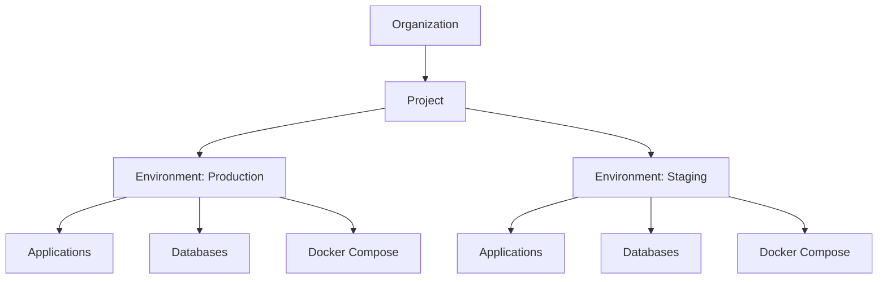

Projects are the top-level organizational unit in Dokploy that help you group related services, applications, and resources together. They provide a logical boundary for managing deployments and sharing configuration across your infrastructure.

## What is a Project?

A project in Dokploy serves as a container for organizing related services and resources. Each project can contain multiple environments (like production, staging, development), and each environment can host various types of services including:

- Applications (web apps, APIs, microservices)
- Databases (PostgreSQL, MySQL, MongoDB, MariaDB, Redis)
- Docker Compose deployments

<CardGroup cols={2}>
  <Card title="Multi-Environment" icon="layer-group">
    Projects support multiple environments, allowing you to separate production from staging and development.
  </Card>
  <Card title="Shared Configuration" icon="gears">
    Define project-level environment variables that are inherited by all services within the project.
  </Card>
  <Card title="Access Control" icon="shield">
    Manage team permissions at the project level with granular access control.
  </Card>
  <Card title="Organization" icon="folder-tree">
    Keep related services together for better organization and management.
  </Card>
</CardGroup>

## Project Structure

The hierarchical structure in Dokploy follows this pattern:



## Creating a Project

Projects are created at the organization level. When you create a new project, Dokploy automatically generates a default "Production" environment to get you started.

### Project Properties

<ParamField path="name" type="string" required>
  The display name of your project. This is what you'll see in the dashboard.
</ParamField>

<ParamField path="description" type="string">
  Optional description to help you and your team understand the purpose of this project.
</ParamField>

<ParamField path="env" type="string">
  Project-level environment variables that will be inherited by all services in all environments. Format: `KEY=value` (one per line).
</ParamField>

## Database Schema

Projects are stored with the following structure:

```typescript
interface Project {
  projectId: string;        // Unique identifier
  name: string;             // Display name
  description?: string;     // Optional description
  organizationId: string;   // Parent organization
  env: string;              // Project-level environment variables
  createdAt: string;        // ISO timestamp
}
```


## Environment Variables Hierarchy

Environment variables in Dokploy follow an inheritance pattern:

1. **Project Level**: Variables defined at the project level are available to all environments
2. **Environment Level**: Variables defined at the environment level override project variables
3. **Service Level**: Variables defined at the application/database level have the highest priority

<Tip>
  Use project-level environment variables for values that are consistent across all environments, such as third-party API endpoints or feature flags.
</Tip>

## Managing Projects

### Viewing Projects

All projects in your organization are displayed in the main dashboard. Each project shows:
- Number of environments
- Total number of services (applications, databases, compose deployments)
- Recent activity and deployment status

### Updating Projects

You can update project properties at any time:
- Change the name or description
- Modify project-level environment variables
- Add or remove environments

<Warning>
  Deleting a project will permanently remove all associated environments, services, and configurations. This action cannot be undone.
</Warning>

### Project Duplication

Dokploy allows you to duplicate projects along with their services and configurations. This is useful for:
- Creating staging environments from production
- Setting up similar projects with different configurations
- Testing major changes in an isolated environment

When duplicating a project, you can choose to:
- Copy all services or select specific ones
- Duplicate into the same project (creates a new environment) or create a new project
- Include or exclude service configurations like domains, mounts, and environment variables


## Access Control

Projects support role-based access control (RBAC) through Dokploy's organization and member management system:

- **Admin**: Full access to create, update, and delete projects
- **Member**: Limited access based on assigned permissions

Members can be granted access to specific projects, environments, and services, allowing for granular control over who can deploy and manage resources.

## Best Practices

<AccordionGroup>
  <Accordion title="Organize by Application or Team">
    Create separate projects for different applications or team boundaries. For example, have a "Frontend" project and a "Backend API" project, or organize by team ownership.
  </Accordion>
  
  <Accordion title="Use Descriptive Names">
    Choose clear, descriptive names that make it easy to identify the purpose of each project at a glance.
  </Accordion>
  
  <Accordion title="Leverage Project-Level Variables">
    Define common configuration values at the project level to avoid repetition across services.
  </Accordion>
  
  <Accordion title="Plan Your Environment Strategy">
    Decide on your environment naming strategy early (e.g., production, staging, development, feature branches) and use it consistently.
  </Accordion>
</AccordionGroup>

## Next Steps

<CardGroup cols={2}>
  <Card title="Environments" icon="layer-group" href="/core-concepts/environments">
    Learn about environments and how they organize services within projects
  </Card>
  <Card title="Applications" icon="rocket" href="/core-concepts/applications">
    Deploy your first application within a project
  </Card>
</CardGroup>